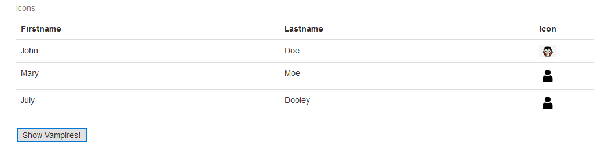

## Where should “Model” be deployed? Server side or client side?

## It depends…

* One thousand users vs one million users?
  * Too many users.
  * Client.
* Heavy jobs handled by servers or clients?
  * Reduce the burden of a client device.
  * Server.
* Hotel example:
  * 1 front desk, fast enough to help 10 clients check in => deploy on server
  * 1 front desk, not fast enough to help 100 clients print check out receipts => deploy on client, mobile phone check out, email PDF 

## View: JavaScript
* This tutorial is based on https://www.w3schools.com/js/
* JavaScript is the programming language of HTML and the Web.
* JavaScript is the default scripting language for HTML.
* JavaScript defines behavior: functional requirements and MVC.
* JavaScript vs jQuery
  * Similar to CSS vs BootStrap
  * jQuery is a JavaScript library, we will learning
  * “Fundamental and necessary” vs “make your life easier”
* [Example 15](https://jsfiddle.net/rxb3ao6y/21/)
* HTML tag &lt;button&gt; defines a clickable button.
* What can JavaScript do?
  * Change HTML content
  * Change HTML attribute value
  * Change HTML styles (CSS) 
* “Inline” method to define behaviors.
* Semicolon (;) is used to separate each line of your code.
* We will learn how to dynamically generate the page contents.

## Group Activity 3: 5 minutes
* Work on Example 15
* Add the third icon column
  * At first: human icon
  * Click button: replace John’s icon to vampire
  * Hint: use “.src” to replace image

||| [Index](../../)||| [Prev](../)|||

