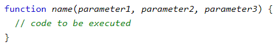

## JavaScript: Scoping

* JavaScript has function-level scope. Different from C: block-level scope.
* Demo

function test(){
        var a = 1+1;
        return a;
 }
 
 var x = 1;
console.log(x); // 1
if (true) {
	var x = 2;
	console.log(x); // 2
}
console.log(x); // 2

function foo() {
	var x = 1;
	if (x) {
		(function () {
			var x = 2;
			// some other code
		}());
	}
	console.log(x); //1
}

## JavaScript: Function positions

* The code inside the function will execute when "something" invokes (calls) the function:
  * When an event occurs (when a user clicks a button)
  * When it is invoked (called) from JavaScript code
  * Automatically (self invoked, recursive)
* Bugs:
  * How to define a function? 
    * Expression: var x = function (a, b) {return a * b};

  * When to call a function?
* Key: If you're not calling anything until everything loads, you should be fine. 

* Based on : <https://stackoverflow.com/questions/7609276/javascript-function-order-why-does-it-matter>

## JavaScript: Function positions and Hoisting
1:
bar(); //This won't throw an error 
function bar() {}

foo(); //This will throw an error
var foo = function() {}

2:
bar();
function bar() {
    foo(); //This will throw an error
}
var foo = function() {}

3:
bar();
function bar() {
    foo(); //This won't throw an error
}
function foo() {}

4:
function bar() {
    foo(); //This won’t throw an error
}
var foo = function() {}
bar();

* Hoisting is JavaScript's default behavior of moving declarations to the top.
* Move all variable declarations and function definition at the top, then value assignments.

1:
var foo = 42;

//the interpreter turns it into this:
var foo;
foo = 42;

2:
var foo = 42;
function bar() {}

//turns into
var foo; //Move to the top
function bar() {}
foo = 42;

3:
bar();
var foo = 42;
function bar() {}
//=>
var foo;
function bar() {}
bar();
foo = 42;

## JavaScript: Function positions and Hoisting

1:
bar();
function bar() {}
//turns to
function bar() {}
bar();

2:
var foo = function() {}
foo();
//=>
var foo;
foo = function() {}
foo();

3:
bar();
function bar() {
    foo();
}
var foo = function() {}
//=>
function bar() {
    foo();
}
var foo;
bar(); // foo is used before defined
foo = function() {}

## JavaScript: Function positions and Hoisting
3:
bar();
function bar() {
    foo(); //This won't throw an error
}
function foo() {}
//=>
function bar() {
    foo(); 
}
function foo() {}
bar();

4:
function bar() {
    foo(); //This won’t throw an error
}
var foo = function() {}
bar();
//=>
function bar() {
    foo();
}
var foo;
foo = function() {}
bar();

||| [Index](../../)||| [Prev](../file7/)||| [Next](../file9/)|||

