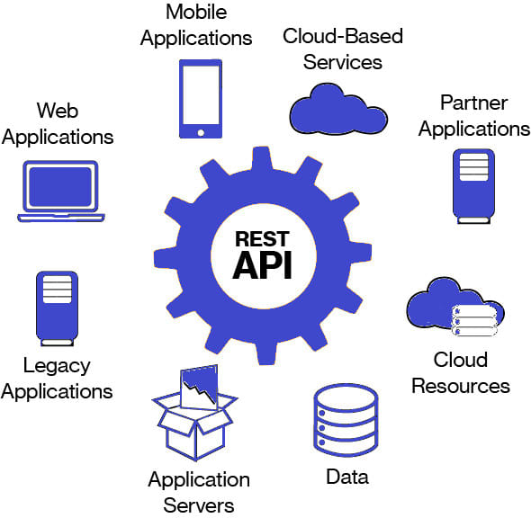

## RESTful Principles

* If an interface needs to be referred as **RESTful**: these five principles are listed below
  * **Client–server** – By separating the user interface concerns from the data storage concerns, REST improves the portability of the user interface across multiple platforms and improve scalability by simplifying the server components.
  * **Stateless** – Each request from client to server must contain all of the information necessary to understand the request, and cannot take advantage of any stored context on the server. Session state is therefore kept entirely on the client.
  * **Cacheable** – Cache constraints require that the data within a response to a request be implicitly or explicitly labeled as cacheable or non-cacheable. If a response is cacheable, then a client cache is given the right to reuse that response data for later, equivalent requests.

<!---->
<!--* Figure credit: <https://www.fiverr.com/megharastogi/build-restful-api-in-php>-->

## REST Principles Continued 
* **Uniform interface** – By applying the software engineering principle of generality to the component interface, the overall system architecture is simplified and the visibility of interactions is improved. In order to obtain a uniform interface, multiple architectural constraints are needed to guide the behavior of components. REST is defined by four interface constraints: identification of resources; manipulation of resources through representations; self-descriptive messages; and, hypermedia as the engine of application state.
* **Layered system** – The layered system style allows an architecture to be composed of hierarchical layers by constraining component behavior such that each component cannot “see” beyond the immediate layer with which they are interacting.

## REST: Architectural Elements
* Most distributed systems do not move the information (data) to the client (processor), instead processing occurs in same location as data
* Three general options for this in hypermedia systems
  * Render data location, send “image” of data to recipient, e.g. image URL
  * Encapsulate data with rendering engine, ship both, e.g. data and visualize function, rare…
  * Send raw data, client chooses rendering engine, e.g. JSON and Google Chart
  
## REST Resource
* The key abstraction of information in REST is a resource. 
* Any information that can be named can be a resource: a document or image, a temporal service, a collection of other resources, a non-virtual object (e.g. a person), and so on. 
* REST uses a resource identifier (such as URL) to identify the particular resource involved in an interaction between components.
* The state of resource at any particular timestamp is known as resource representation. A representation consists of data, metadata describing the data and **hypermedia** links which can help the clients in transition to next desired state.

|||[Index](../../)||| [Prev](../part3/)||| [Next](../part5/)|||

