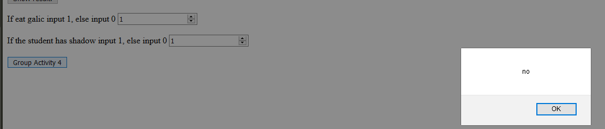

## JavaScript Basic

* In HTML, JavaScript programs are executed by the web browser.
* A JavaScript program is a list of programming statements.
  * Values: var x = 8;
  * Operators: var x = 8;
  * Expressions: any valid set of literals, variables, operators, and expressions that evaluates to a single value. E.g., x = 7; 3+4
    * Conditional Expressions: var status = (age >= 18) ? "adult" : "minor"
  * Keywords: for, if … else
  * Comments: after //, won’t be executed.
* Semicolons (;) separate JavaScript statements.
* For best readability, programmers often like to avoid code lines longer than 80 characters. => break a line after an operator.
* Example 19



## Group Activity 4: 5 minutes
* Work on Example 19
* &lt;form&gt;, &lt;label&gt; and &lt;input&gt; are new, we will come back to them later
* Decide if vampire based on user input values:
  * A user should be able to input numbers
  * The same logic should be applied to determine if a student is a vampire or not.
    * var status = (galic+shadow >= 2) ? "no" : "not sure";
  * Hint: use .value to get value of an &lt;input&gt; element and parseInt(String) to convert a string to an integer.

## Basic Data Visualization: Google Chart
* Last class, I showed you “View” components using tables.
* Example 20
* A callback function is a function passed into another function as an argument, which is then invoked inside the outer function to complete some kind of routine or action.
* Google Chart four steps:
  * Import external library
  * Prepare your data in a datatable
  * Choose a visualization method
  * Create an HTML element to render the chart
  


## Basic Data Visualization: HW3 View Example
* Example 21
* Dynamically update Google Chart.
* If … else … statement
  * Use if to specify a block of code to be executed, if a specified condition is true
  * Use else to specify a block of code to be executed, if the same condition is false
  * Use else if to specify a new condition to test, if the first condition is false
  * Use switch to specify many alternative blocks of code to be executed
  
## Basic Data Visualization: HW3 View Example
* JavaScript array.
  * var array_name = [item1, item2, ...]; 
  * Arrary_name[0];
* JavaScript Date data type.
  * new Date(year, month, ...)
  * 7 numbers specify year, month, day, hour, minute, second, and millisecond (in that order):
    * var d = new Date(2018, 11, 24, 10, 33, 30, 0);
    * 11 means December, because month is starting from 0
 * Can also be defined as the below table. E.g., var d = new Date("2015-03-25");
 * var oneDay = 24*60*60*1000; // hours*minutes*seconds*milliseconds
 * var diffDays = Math.abs((dat1.getTime() - dat2.getTime())/(oneDay)); alert(diffDays); //calculate differences

||| [Index](../../)||| [Prev](../file3/)||| [Next](../file5/)|||

