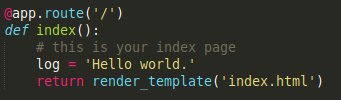

## What is REST?

* REST = Representational State Transfer
* Defined in Roy Fielding’s thesis, chapter 5, available here: http://www.ics.uci.edu/~fielding/pubs/dissertation/rest_arch_style.htm
* This class is also based on: https://restfulapi.net/
* REST is a software architecture:
  * A hybrid style, combining several architectural styles

## What is RESTful API?

## Software architectures

* “A software architecture is an abstraction (high-level) of the run-time elements of a software system during some phase of its operation. A system may be composed of many levels of abstraction and many phases of operation, each with its own software architecture.”
  * Multiple phases: start-up, normal operation, etc
  * Multiple levels, different levels of architectural details
  * Focus is on run-time, separates the discussion of architecture from the static structure of program source code

* “A software architecture is defined by a configuration of architectural elements—components, connectors, and data—constrained in their relationships in order to achieve a desired set of architectural properties.”
  * Components: Elements that process system data
  * Connectors: Elements that connect pieces of the architecture
  * Data: The information used and transformed in the system
  
## Components

* “A component is an abstract unit of software instructions and internal state that provides a transformation of data via its interface.”
  * Software instructions: what the component actually does (behavior)
  * Internal state: impacts behavior, not seen from the outside
  * abstract unit…via its interface: components accessed through an interface, not directly, we see interface and services but not internal states and implementation details (blackbox)
  
## Connectors

* “A connector is an abstract mechanism that mediates communication, coordination, or cooperation among components.”
* transfer data elements between components
* no visible changes to the data — although they may do encoding/decoding steps internally, these are not seen outside the connectors

## Data
* “A datum is an element of information that is transferred from a component, or received by a component, via a connector.” (such as xml and JSON)
  * information transferred to, or received from, a component using a connector
  * does not include internal state information
  * not included in all architectural descriptions, but important for those where data plays a major role (e.g., online purchase system)

## Configurations
* “A configuration is the structure of architectural relationships among components, connectors, and data during a period of system run-time.”
  * represents collections of interacting components and connectors
  * constrains how components interact
  * allow distinguishing between a given “state” versus the universe of possibilities for component/connector structuring

## Design Patterns

* Design patterns, pattern languages are used to describe commonly recurring programming scenarios.
* Styles give a similar shorthand to describing possibly complex configurations and interactions

PLACE EXAMPLE 44 HERE

|||[Index](../../)||| [Prev](../)|||

