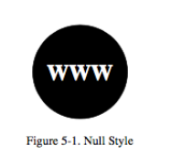
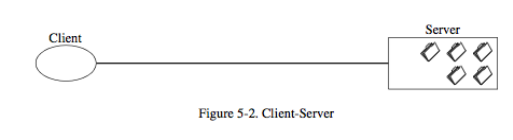
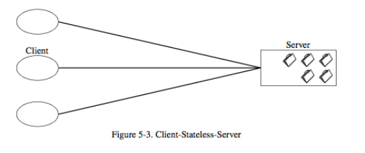
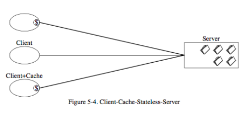

## Building REST: Starting with nothing

* First, start by imposing no constraints
* No distinguished boundaries between components

## Building REST: Adding in client/server
* First constraint: REST uses a client/server style
* Gives us separation of concerns: data storage on the server, UI on the client, makes UI more portable and server simpler
* Also allows separate evolution, multiple domains

## Building REST: Enforcing stateless-ness

* Like the web, REST is stateless, session state is entirely on the client and is sent with each request
* Improves visibility, reliability, scalability, but may reduce performance and application consistency

## Building REST: Enabling caching

* Caching of responses is optional, servers indicate which responses can be cached, such as jQuery, BootStrap
* Improve efficiency and performance

|||[Index](../../)||| [Prev](../)||| [Next](../part3/)|||

