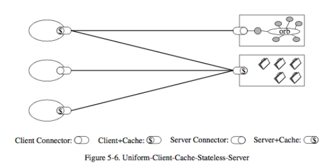
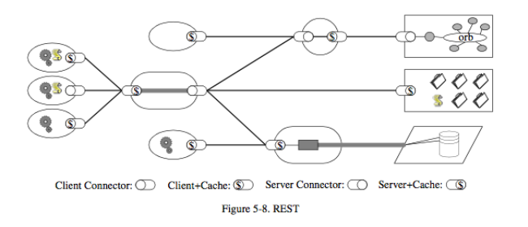

## Building REST: Providing a uniform interface
* Interface constraints allow a standard interface for all requests
* Simplify maintenance

## Building REST: Code on Demand
* Simplifies clients, Extendibility (add new components, new features)
* Reduces visibility, increases complexity — this step is optional

## Building REST: The REST Architecture
## Example 46
* This example is about coding convention checking:
  * <https://github.com/ruiwu1990/coding_convention_tool>
* How to use external executable file in your application.
  * Python: subprocess
  * Four steps:
    * Prepare command
    * Open log files
    * Execute external file
    * Wait until it is done.
* Pylint:<https://www.pylint.org/>
* Checkstyle: <http://checkstyle.sourceforge.net/>
* Some issues with Example 45. I will fix it and introduce it in our next class.

## Final Group Project Presentation

* We will use the following two Google forms to grade your final group project presentations:
  * April 23: <https://forms.gle/XXzVkBm67CViY8Sv7>
  * April 28: <https://forms.gle/bHfCJuKbRUdB5K7i8>
* Need to demo your web app
* Rubric to grade your presentation

## About final exam
* CSCI 4710 and CSCI 6710: You can choose any day between April 30 – May 3.
* Closed book exam
* Online Blackboard, 1 hour and 30 minutes
* Similar to the midterm.
  * 40 multiple choices questions
  * 7 short answer questions for CSCI 4710, 8 short answer questions for CSCI 6710
* Final exam covers all the things we have learned this semester
* No sample questions
* I will upload a video about Docker by the end of this week, required

|||[Index](../../)||| [Prev](../part2/)||| [Next](../part4)|||

