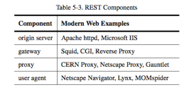

## REST Resource Methods
* Roy Fielding has never mentioned any recommendation around which method to be used in which condition. All he emphasizes is that it should be uniform interface.
  * E.g.: GET/PUT/POST/DELETE
* Ideally, everything that is needed to change the resource state shall be part of API response for that resource – including methods and in what state they will leave the representation.

## REST != HTTP
* In the REST architectural style, data and functionality are considered resources and are accessed using Uniform Resource Identifiers (URIs). 
* RESTful applications should be simple, lightweight, and fast.
  * Resources are decoupled from their representation so that their content can be accessed in a variety of formats, such as HTML, XML, plain text, PDF, JPEG, JSON, and others. Metadata about the resource is available and used, for example, to control caching, detect transmission errors, negotiate the appropriate representation format, and perform authentication or access control. And most importantly, every interaction with a resource is stateless.
* The resources are acted upon by using a set of simple, well-defined operations (e.g. GET/POST). The clients and servers exchange representations of resources by using a standardized interface and protocol – typically HTTP.

## PostgreSQL and Flask
* Example 45: <https://github.com/ruiwu1990/db_docker>

## REST Data Elements

## REST Connectors

## REST Components

## REST: Three views
* Process view: how do components interact?
  * Processes connect in a pipe-and-filter style, each request may include different processes
* Connector view: how do components communicate?
* Data view: what is the application state as data flows through the components?

|||[Index](../../)||| [Prev](../part4/)|||

