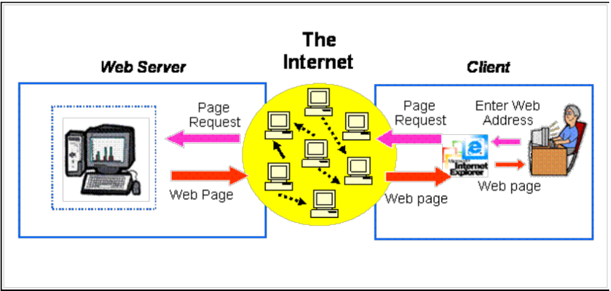

## What techniques and languages?
* Backend:
  * PostgreSQL: database
  * Flask: backend framework
  * Python: programming language (popular: <http://pypl.github.io/PYPL.html>)
* Frontend:
  * JavaScript: programming language (a joke: <http://vanilla-js.com/>) (language C vs Python)
  * jQuery: a JavaScript library designed to simplify HTML DOM tree traversal and manipulation
  * HTML: Hypertext Markup Language
  * BootStrap: front-end framework for developing websites and web applications
  * d3js: a powerful JavaScript data visualization and interaction library.
* Full stack developer means you should know both.

## Web application

* Image credit: <http://teaching.shu.ac.uk/aces/rh1/de/web_based_systems_architectures_1_tutorial_files/image004.gif>

## W3C
* The World Wide Web Consortium is the main international standards organization for the World Wide Web.
* We will use it for some definitions.
* <https://www.w3.org/>

* Uniform Resource Locators (URLs)
* Uniform Resource Identifiers (URIs, aka URLs) are short <mark>strings</mark> that identify resources in the web: documents, images, downloadable files, services, electronic mailboxes, and other resources.
* It is similar to a mailing address.

* More details, see <https://www.w3.org/Addressing/>
* Examples:
  * <https://www.amazon.com>
  * <https://www.ecu.edu/cs-acad/registrar/General-Information.cfm>
  * <https://www.sensor.nevada.edu/NRDC/>

## Domain Name
* A domain name is an identification string that defines a realm of administrative autonomy, authority or control within the Internet (Wiki).
* For example, 
  * URL: www.example.com/index
  * Domain name: example.com

## IP Address
* An Internet Protocol address (IP address) is a numerical label assigned to each device connected to a computer network that uses the Internet Protocol for communication (Wiki).
* A unique identifier given to every machine that connects to the internet. 
* Typical IPv4 addresses resemble the following: 192.x.x.x while IPv6 addresses look similar to: fdc4:xxxx:xxxx::/48.
* It is also similar to a mailing address.

|||[Index](../../)||| [Prev](../)||| [Next](../file2)|||

