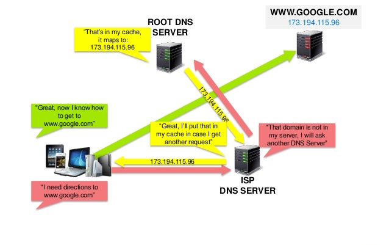

## Domain Name System
* Servers do not recognize your domain name.
* Banner ID (IP address) vs Name (domain name)
* The Domain Name System (DNS) is a hierarchical decentralized naming system for computers, services, or other resources connected to the Internet or a private network (Wiki).
* It can provide you IP address based on a domain name (similar to your contact app).

## How does it work?

* Figure credit: <http://massivetechinterview.blogspot.com/2015/12/dns-internal.html>

## Question:
* Why don’t we use IP directly?
  * Because it is hard to remember…
* It is often case that multiple web server components (e.g. login, data visualization,...) will handle sites on the same IPv4 address with different ports.
* DNS attack:
  * <https://searchsecurity.techtarget.com/definition/DNS-attack>
* However, sometimes, you need to use IP instead of URL:
  * If a website’s DNS system is down then you may still be able to access it via its IP address. This occurred during Twitter’s large outage back in 2016.
  * A particular system may only accept IP addresses, therefore you need to convert your URL to IP.
  * You want to find out more information about the URL including who owns it, where it resides, or simply check if the domain record is correct.
* Find your IP address:
  * Windows: cmd -> ipconfig
  * Ubuntu: ip a

||[Index](../../../)||| [Prev](../)|||[Next](../file3)|||

