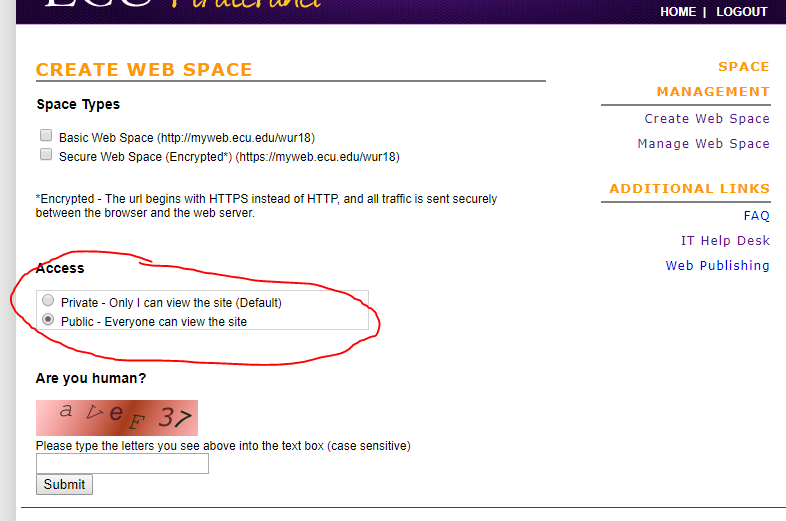
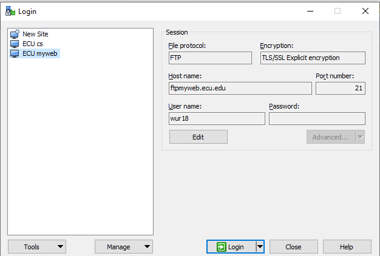

## Here are some rules…
* &lt;head&gt;: a container for metadata (data about data) and is placed between the &lt;html&gt; tag and the &lt;body&gt; tag. Check [example 01](https://jsfiddle.net/rxb3ao6y/1/)
  * The following tags describe metadata: &lt;title&gt;, &lt;style&gt; (CSS, will learn), &lt;meta&gt; (define fonts, website keyword…), &lt;link&gt; (CSS, will learn), &lt;script&gt; (JavaScript, will learn), and &lt;base&gt;.
  * &lt;base&gt;: [example 4_1](https://jsfiddle.net/rxb3ao6y/5/), defines a base URL
* &lt;body&gt; tag defines the document's body.
  * contains all the contents of an HTML document, such as text, hyperlinks, images, tables, lists, etc.
  * contains the visible page content
  
## Homework 1 (Part 1)

## Homework 1 (Part 2)

* Write a paragraph of self-introduction. You can use your homework 0.
* Need to at least include your background, why you choose computer science and this class.
* Implement a simple webpage with your introduction, your photo (or a cartoon fake photo).
* Upload your web page to your URL
* Submit your homework 1, ONLY URL
* Due <mark>Feb. 15</mark>

## How to upload files to your URL
* Download WinSCP: <https://winscp.net/eng/download.php>
* Click "Advanced"->Click "Directories"->Find "Remote directory"-> Input “/student/pirateID/"->Click "OK"
* Here are more details: <https://ecu.teamdynamix.com/TDClient/1409/Portal/Requests/ServiceDet?ID=31623> 
* Demo

## Things about HW1 and possible jobs
* HW1
  * Cisco VPN
  * Permissions denied

## Problems Left From Previous Class
* Base Example: example 04_1
* Load your font Example: example 04_2

## HTML DOM
* Document Object Model (DOM)
* The HTML DOM is an Object Model for HTML. It defines:
  * HTML elements as objects
  * Properties for all HTML elements
  * Methods for all HTML elements
  * Events for all HTML elements

## HTML DOM Tree of Objects

* When a web page is loaded, the browser creates a DOM of the page.

## Also, event-driven programming

* In computer programming, event-driven programming is a programming paradigm in which the flow of the program is determined by events such as user actions (mouse clicks, key presses), sensor outputs, or messages from other programs or threads (like time reaches 10s). Event-driven programming is the dominant paradigm used in graphical user interfaces and other applications (e.g., JavaScript web applications) that are centered on performing certain actions in response to user input (wiki).
  * E.g., a user clicks a button.
  * E.g., a data processing job has been done on the server.
  * E.g., data records arrive frontend (sensor streaming data visualization).

## Web application

* Figure Credit: <http://teaching.shu.ac.uk/aces/rh1/de/web_based_systems_architectures_1_tutorial_files/image004.gif>

## What will we look at?

* Transport protocols (brief introduction)
* Messaging protocols
* Building web services clients
* RESTful web services
* “Traditional” (SOAP-based) web services

|||[Index](../../../)||| [Prev](../file4/)|||[Next](../file6/)|||

