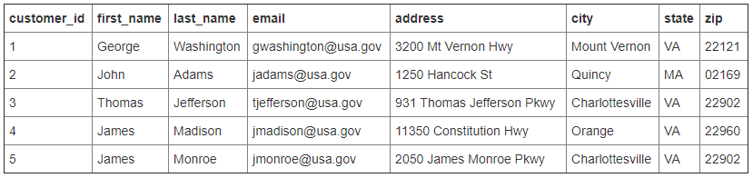
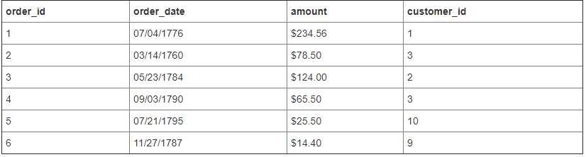

## Relational DB Advantages vs Disadvantages

* Relational databases store data efficiently and avoid duplication. 
  * Renaming a user role in this database is simple because role names exist in a single place. Immediately after a role name is changed in the roles table, all users that have a role_id that references the changed role will see the update.
* Having the data split into multiple tables can be a complication.
  * Producing a listing of users with their roles presents a small problem, because users and user roles need to be read from two tables and joined before they can be presented together. Relational database engines provide the support to perform join operations between tables when necessary.
  
## Relational DB: join example

* Connect order information with customer
* Based on: <http://www.sql-join.com/>

* This is one example how to join (combine) two tables.
Most relational DB engines support join operations.

## NoSQL Database

* Databases that do not follow the relational model described in the previous slides are collectively referred to as NoSQL databases.
  * NoSQL DB does not use the tabular relations.
  * NoSQL has the same purposes: storage and retrieval of data.
  * NoSQL databases uses collections instead of tables and documents (such as BSON (Binary JSON) in MongoDB) instead of records. MongoDB represents JSON documents in binary-encoded format called BSON.
  * NoSQL databases are designed in a way that makes joins difficult.

* {
    "FirstName": "Bob", 
    "Address": "5 Oak St.", 
    "Hobby": "sailing"
}



* An appropriate design for a NoSQL database: denormalization, which reduces the number of tables at the expense of data duplication.
* Bad news: a database with this structure has the role name explicitly stored with each user. Renaming a role can then turn out to be an expensive operation that may require updating a large number of documents. E.g., username -> last name, first name.
* Good news: Having the data duplicated allows for faster querying. Listing users and their roles is straightforward because no joins are needed.

## Relational vs NoSQL Database

* Data structure: 
  * Relational databases were built in an era where data was fairly structured and clearly defined by their relationships. NoSQL databases are designed to handle unstructured data (e.g., texts, social media posts, video, email) which makes up much of the data that exists today.
* Scaling: 
  * It’s much cheaper to scale a NoSQL database than a relational database because you can add capacity by scaling out over cheap, commodity servers. Relational databases, on the other hand, require a single server to host your entire database. To scale, you need to buy a bigger, more expensive server. Why single server? Some functions such as “join” are hard to be implemented with multiple servers.
* Development model: 
  * NoSQL databases are usually open source whereas relational databases typically are closed source with licensing fees baked into the use of their software. With NoSQL, you can get started on a project without any heavy investments in software fees upfront.

* Based on MongoDB: <https://www.mongodb.com/scale/nosql-vs-relational-databases>

|||[Index](../../)||| [Prev](../)||| [Next](../part3/)|||

