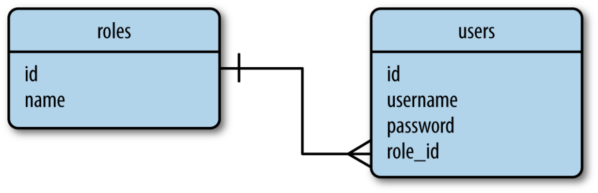

## Which database?

* There are a number of factors to evaluate when choosing a database framework:
  * Ease of use
  * Performance
  * Portability
  * Flask integration
* Based on these, we will learn…

## Database

* In this class, we will learn:
  * Relational DB:
    * SQLAlchemy
    * PostgreSQL 
  * Examples are based on HTTP requests that we have learned.

## Setup and hello world
* Example 39
* PLACE LINK 39 HERE
* How to set up SQLAlchemy.
* 404 Page: default for service not fount error
* 500 Page: default for server errors, need to turn off debug mode

* db.Column first possible parameters

* db.Column second possible parameters

* db.create_all() function locates all the subclasses of db.Model and creates corresponding tables in the database for them.

* db.session.commit(), you need to commit your changes (insert, delete, modify) and then the DB will be updated

|||[Index](../../)||| [Prev](../part2/)||| [Next](../part4)|||

