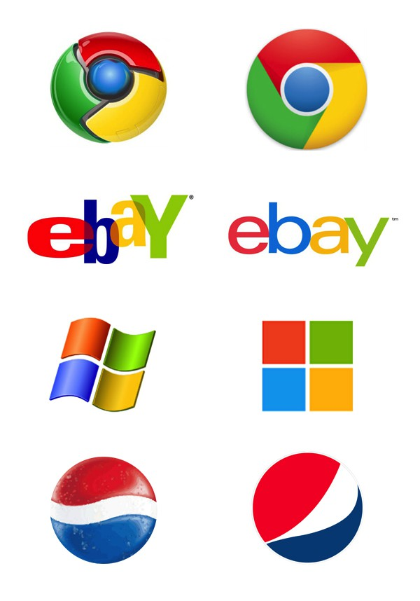

## Form your team
* Don’t wait until the weekend to form your team.
* 2 - 3 students in each team.
  * Group homework
  * Group project
  * Group activities.
  
* Group project: Implement a web application with at least:
* Backend:
  * PostgreSQL
  * Flask
  * Python
* Frontend:
  * JavaScript
  * Jquery
  * Reactjs
  * HTML
  * BootStrap
* April 21 and 23 Demo, your show time
  * Top 3 team will be announced based on your ranking
  * More details will be announced

## Web Page Design
* Many things you need to consider: layout, color design, contents… 
* First, there is a job named “web designer”: https://study.com/articles/Web_Designer_Job_Description_Duties_and_Requirements.html
* Possible rules you may follow:
  * Clean and only highlight important things
  * Logo, make people easy to remember your website
  * Fixed sidebar navigation
  * …
* There is no such a rule always working…
* If you feel comfortable, that is good enough for this class.

## Web Page Design: Flat Design
* Wiki: flat design is a minimalist user interface (UI) design genre, or design language, commonly used in graphical user interfaces.
* Interface design emphasizing minimum use of stylistic elements
  * Avoid: illusion of three dimensions, e.g. use of drop shadows, gradients or textures
  * Use: bold shapes, colors, images (e.g., icons)

* Examples: 
  * <https://www.microsoft.com/>
    * Microsoft official website.
  * <https://d3js.org/>
    * A very powerful data visualization library

* Realism Design Example
  * <https://www.apple.com/iphone-12/>
    * Apple website, need to use Chrome browser

* Flat design advantages:
  * It is easier to quickly convey information while still looking visually appealing and approachable. 
  * It makes it easier to design an interface that is responsive to changes in browser size across different devices. 
  * It enables a user to focus on the contents.
  * With minimal design elements, websites are able to load faster and resize easily.
  * Still look sharp on high-definition screens.

||[Index](../../../)||| [Prev](../)|||[Next](../file2)|||

