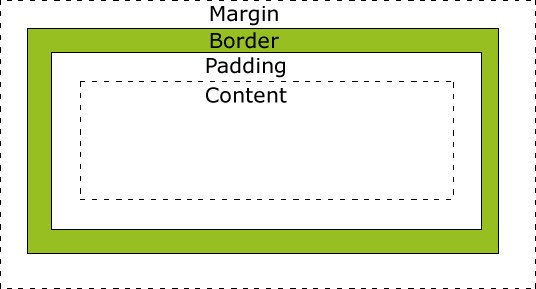

 

## CSS Colors
* Here are some common ways you can define a color:
  * Names: <https://www.w3schools.com/colors/colors_names.asp>
  * Hex number: <https://developer.mozilla.org/en-US/docs/Web/CSS/CSS_Colors/Color_picker_tool>
    * #000 black
    * #ffffff white
  * RGB: (Red, Green, Blue)
  * RGBA (red, green, blue, alpha)
  * HSLA (Hue, Saturation, Light, and Opacity)

* [Example 08](https://jsfiddle.net/rxb3ao6y/11/)

## Which Colors You should Use
* Psychology: some colors mean optimism and some mean trust…

* Figure Credit: <https://creativemarket.com/blog/color-combination-tips>

* How to choose theme colors:
  * <https://coolors.co>, free and provide you some suggestions.
  * <http://paletton.com>, design examples provided by the website>
* Some tips on color choosing

## What is the effect of yellow and purple?
* Purple is used for <mark>creative and imaginative</mark> projects where wisdom is needed. Yahoo uses purple.
* Yellow is associated with feelings of <mark>warmth, clarity and optimism.</mark>
* Yellow and Purple: grab attention.
  * 

## CSS examples: Horizontal Navigation Bar
* [Example 09](https://jsfiddle.net/rxb3ao6y/13/)
* HTML tag:
  * ul: defines an unordered list
  * li: defines a list item
* CSS margin vs border vs padding: 
  * They all generates space around an element.
  * Positions are different.
* Class active: indicates the active page or link, the page or link you are in
* 
* Figure credit: <https://stackoverflow.com/questions/2189452/when-to-use-margin-vs-padding-in-css>

## Group Activity 1: 5 minutes
* Work on [Example 09](https://jsfiddle.net/rxb3ao6y/12/)
  * Highlight current selected page with color green in the navigation bar
  * Hover color changed to: lawngreen (hint: li a:hover)

## CSS examples: Vertical Navigation Bar
* [Example 10](https://jsfiddle.net/rxb3ao6y/15/)
* Question: how to avoid repeated navigation bar code? We will learn it when we introduce Jinjia2
* .active vs .hover:
  * Active: current website you are in
  * Hover: when your mouse cursor is located at current position

## Homework 2
* Add a navigation bar to your current personal website
* At least two pages should be functional (e.g. introduction and background)
* You may split your original contents into two parts
* Apply your theme colors
* Due <mark>Feb. 22</mark>

||[Index](../../../)||| [Prev](../file2)|||[Next](../file4)|||

