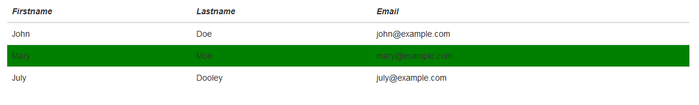

## BootStrap Classes

* BootStrap has many predefined styles stored in bootstrap.min.css.
* How does BootStrap know which style to apply? => Class names:
  * class = “table” Adds basic styling to a table (padding, bottom borders, etc)
  * class = “table-hover” Creates a hoverable table (adds a grey background   color on table rows on hover)
  * class = “table-bordered” Adds borders on all sides of the table and cells
  * BootStrap all classes are listed at: <https://www.w3schools.com/bootstrap/bootstrap_ref_all_classes.asp>
* Here are four examples
 
## BootStrap Table
* HTML table tags:
  * Use the HTML &lt;table&gt; element to define a table
  * Use the HTML &lt;tr&gt; element to define a table row
  * Use the HTML &lt;td&gt; element to define a table data
  * Use the HTML &lt;th&gt; element to define a table heading
  * Use the HTML &lt;thead&gt; element to group header content in an HTML table. After &lt;table&gt;, &lt;caption&gt;, before &lt;tbody&gt; (table body), &lt;tfoot&gt; (table footer), and &lt;tr&gt;
* [Example 13_1](https://jsfiddle.net/rxb3ao6y/18/)
* One HTML element can have multiple classes:
  * It is like a person can be classified as your friend and teacher.
* Responsive Tables, defined in &lt;div&gt; instead of &lt;table&gt;

## Group Activity 2
* 5 minutes
* Work on [Example 13_1](https://jsfiddle.net/rxb3ao6y/18/), second table
* First row: italic
* Other rows: hover ->background color changes to green
* Other tables should not be affected!

## BootStrap Navigation Bar
* [Example 13](https://jsfiddle.net/rxb3ao6y/19/)
* <nav> tag defines a set of navigation links.
* A standard navigation bar is created with &lt;nav class="navbar navbar-default"&gt;.
* Default style looks not bad: style hiding in BootStrap CSS
* You can also define your own style.
* Container vs container-fluid class:
  * The .container class provides a responsive fixed width container
  * The .container-fluid class provides a full width container, spanning the entire width of the viewport
* Vertical and other styles:
  * <https://getbootstrap.com/docs/4.0/components/navs/>

## BootStrap Carousel 
* Some examples:
  * https://m.ecu.edu/
  * https://www.amazon.com/
  * https://www.ebay.com/
* Also called slideshow
* [Example 14](https://jsfiddle.net/rxb3ao6y/20/)
* The outermost &lt;div&gt;:
* Carousels require the use of an id (in this case id="myCarousel") for carousel controls to function properly.
* The class="carousel" specifies that this &lt;div&gt; contains a carousel.
* The data-ride="carousel" attribute tells Bootstrap to begin animating the carousel immediately when the page loads.

## BootStrap Carousel 
* The "Indicators" part:
  * The indicators are the little dots at the bottom of each slide (which indicates how many slides there is in the carousel, and which slide the user are currently viewing).
  * The indicators are specified in an ordered list with class .carousel-indicators.
  * The data-target attribute points to the id of the carousel.
  * The data-slide-to attribute specifies which slide to go to, when clicking on the specific dot.
* The "Wrapper for slides" part:
  * The slides are specified in a &lt;div&gt; with class .carousel-inner.
  * The content of each slide is defined in a &lt;div&gt; with class .item. This can be text or images.
  * The .active class needs to be added to one of the slides. Otherwise, the carousel will not be visible.
* The "Left and right controls" part:
  * This code adds "left" and "right" buttons that allows the user to go back and forth between the slides manually.
  * The data-slide attribute accepts the keywords "prev" or "next", which alters the slide position relative to its current position.
* BootStrap icons: <https://getbootstrap.com/docs/3.3/components/>
* <mark> Question </mark> Why did we “waste” our time on CSS? Should we just learn BootStrap?

## CSS is the base
* Here are some my personal opinions:
  * We still need CSS to define some our own styles, such as text color.
  * CSS is the fundamental part. If you understand CSS, then you can easily learn other frameworks.
  * If you do not learn CSS, you won’t learn how BootStrap works and modify some parts of BootStrap.
  * One day, you may find existing framework is not perfect and want to create your own framework. You need fundamental knowledge, such as CSS. E.g., React created by Facebook for dynamic content changing in a view (page)

## Bootstrap Latest version
* 4.5.3
* Released 3 months ago
* New things will pop up all the time. But the fundamental theory is the same.
* For example, CSS vs Bootstrap
	
||[Index](../../../)||| [Prev](../file5)|||

