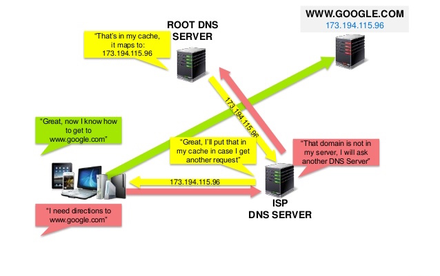

## Domain Name System
* Servers do not recognize your domain name.
* Banner ID (IP address) vs Name (domain name)
* The Domain Name System (DNS) is a hierarchical decentralized naming system for computers, services, or other resources connected to the Internet or a private network (Wiki).
* It can provide you IP address based on a domain name (similar to your contact app).

## How does it work?

* Figure credit: <http://massivetechinterview.blogspot.com/2015/12/dns-internal.html>
||[Index](../../../)||| [Prev](../)|||[Next](file3)|||

