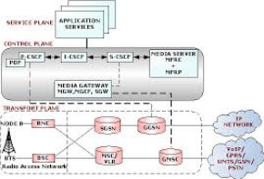

## Final Group Project: Part 3

* Demo Day: 
  * 24 groups in total, each team will have 6 minutes to present using WebEx Online
  * At least one team member needs to show up to present.
  * April 23 & 28. The order will be randomly decided and announced after we introduce a random order web application example (example 44).
* Google Forms will be used to collect opinions from audience.
* README: team member names and emails
* Due...

## How to store user input information

* Example 43
* PLACE LINK 43 HERE
* Dropzone.js library => simplify the drag and drop process 
  * <https://www.dropzonejs.com/>
* Extension of Example 37
* Check if the folder exists, if not create one.
  * os.path.exists
* A complex css file, not written by me but very powerful. Support image thumbnail

## How do these map to web services?

* GET is used to get something from a web service
* POST is used to contribute something to a web service, to add new information
* PUT is used to update existing information
* DELETE is used to delete existing information
* Other actions may be used as well, these are the most common

## Messaging Protocols

## Common message protocols

* SOAP/XML (also called “pox”, “plain old xml”)
* JSON

|||[Index](../../)||| [Prev](../)||| [Next](../part2)|||

