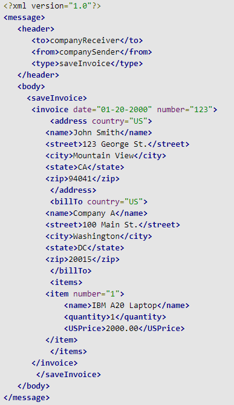
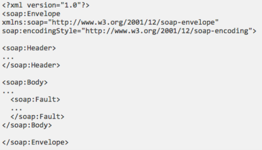

## A quick introduction to XML

* XML: Extensible Markup Language (http://www.w3.org/XML/)
* Derived from SGML (like HTML)
* XML as a generic format for exchanging information: you can also use it for other applications besides web app 
  * E.g. NoSQL DB
* XML comes with a suite of standards: XML DOM, XML-Schema, XPath, XQuery, etc…

## An example of XML message

* Figure credit: <https://www.javaworld.com/article/2075082/xml-messaging--part-1.html>

## A quick introduction to SOAP

* SOAP stands for Simple Object Access Protocol
  * an application communication protocol
  * a format for sending and receiving messages
  * platform independent
  * based on XML
* SOAP (<http://www.w3.org/TR/soap/>) is an XML format for exchanging web services messages
* Original Simple Object Access Protocol, now just SOAP
* SOAP often goes with a variety of other technologies: all the XML technologies, plus all the WS technologies (referred to as WS-*)
* SOAP provides a way to communicate between applications running on different operating systems, with different technologies and programming languages.
* A SOAP message MUST be encoded using XML
* A SOAP message MUST use the SOAP Envelope namespace
* A SOAP message MUST use the SOAP Encoding namespace (Array element and the arrayType attribute used to encode Vector and Array java objects.)

## SOAP Messages

* <https://www.w3schools.com/xml/xml_soap.asp>

|||[Index](../../)||| [Prev](../)||| [Next](../part3/)|||

