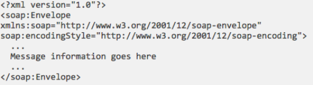
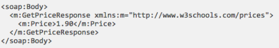

## SOAP Envelopes

* SOAP envelopes must be present, and act as “wrappers” for soap messages
* An Envelope element that identifies the <mark>XML</mark> document as a SOAP message
* Contents include (optional) headers and the message body

* Figure Credit: <https://www.w3schools.com/xml/xml_soap.asp>

## SOAP Headers

* SOAP Headers provide optional, <mark>application-specific</mark> information (e.g., special security information)
* soap:mustUnderstand, indicates whether the receiver <mark>must process the header and understand it</mark> — e.g., if this is for security, you would want to make sure this is handled correctly
* soap:actor, allows different headers to be processed by different receivers along a multi-receiver route
* soap:encodingStyle, specifies encoding for this element and all child elements (e.g., using standard SOAP encoding)

## SOAP Bodies

* The bodies contain the actual message being transmitted
* A Body element that contains <mark>call</mark> and <mark>response</mark> information
* Elements come from a service-specific namespace, based on what the service expects

* Figure Credit: <https://www.w3schools.com/xml/xml_soap.asp>

## SOAP Faults

* SOAP Faults containing <mark>errors</mark> and <mark>status</mark> information
* Standard child tags:
  * aultcode: a defined code identifying the error
  * faultstring: a human-readable message describing the error
  * faultactor: the actor that triggered the fault
  * detail: application-specific info on the error
  
|||[Index](../../)||| [Prev](../part2/)||| [Next](../part4/)|||

