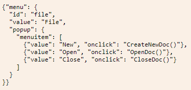

## A quick introduction to JSON

* JSON: JavaScript Object Notation (<http://json.org/>)
* Designed as a lightweight alternative to XML
* Values built from basic data types, lists/arrays, and structures/objects
* Values are easy to read and are actual code (so they don’t need to be converted from XML data types into JavaScript)

## A JSON Example

## Advantages vs Disadvantages

* Advantages: 
  * Smaller message size, faster loading speed
  * Easier to be parsed by JavaScript
* Disadvantages:
  * <mark>No error handling for JSON calls</mark>
  * <mark>unsecure</mark>, a JSON service returns a JSON response wrapped in a function call. if a service from untrusted server, it can cause a security issue

|||[Index](../../)||| [Prev](../part3/)|||

