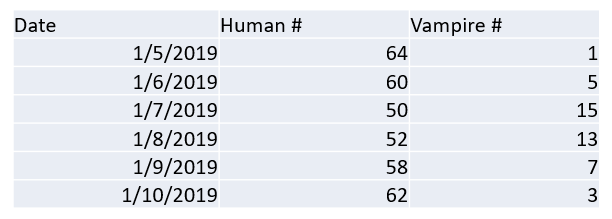
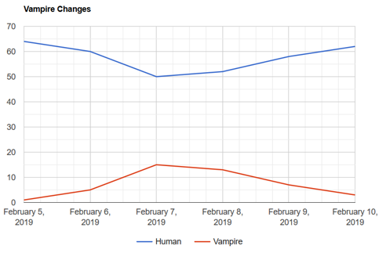
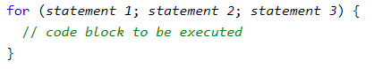

## Group Activity 5: 5 minutes

* Work on Example 22
Use Google Line chart to show the following data.
* 
* 

# JavaScript Debug
* Debugging is not easy. But fortunately, all modern browsers have a built-in JavaScript debugger.
* Two main methods:
  * Console.log()
  * Setting Breaking points.
* Demo: setting breaking points.

## JavaScript Coding Conventions

* Coding conventions are style guidelines for programming. They typically cover:
  * Naming and declaration rules for variables and functions.
  * Rules for the use of white space, indentation, and comments.
  * Programming practices and principles
* Why? Example 23
* Variable and function names:
  * <mark>camelCase</mark>: e.g. myDataTable, vampireModelFeature
  * <mark>snake_case</mark>: e.g. my_data_table, vampire_model_feature
* Spaces around operators. E.g.:
  * Always put spaces around operators ( = + - * / ), and after commas
  * var x = y + z;
  * var values = ["Volvo", "Saab", "Fiat"];
* No perfect rules. But we need a rule…

## Midterm and Sample Questions
* Sample Questions available on Canvas.
* I will go through them on March 3.
* Midterm will be avaiable from March 8 - 9.
  * 20 multiple choice questions
  * 4 short answer questions (do not require you to write a complete program)
  * Review content on course website and sample codes
  * <mark>No Class March 8.</mark>

## JSON: Basic
* JSON: JavaScript Object Notation
* JSON is a syntax for storing and exchanging data
* JSON is a lightweight data-interchange format
* In JSON, values must be one of the following data types:
  * a string: “human”
  * a number: 10
  * an object (JSON object)
  * an array: [1,2,3,4,5 …]
  * a Boolean: true/false
  * null: means empty
*  Cannot
  * a function
  * a date (usually use string in JSON for date)
  * Undefined variables
  
## JSON
* Keys must be strings, and values must be a valid JSON data type 
* JSON objects: 
{
"employee":{ "name":"John", "age":30, "city":"New York" }
}

* JSON Booleans: { "sale":true }
* JSON null: { "middlename":null }



* HW3: Model Example 24
  * JavaScript for loop
  * a++; => a = a + 1;
  * a--; => a = a – 1;
* We will learn how to send and receive JSON data when we introduce the server part.
* If you want to pass a parameter to google.setOnLoadCallback()
  * google.setOnLoadCallback(function() { drawChart(input_data); });
* Be consistent for the same function…
<!-- * In software engineering, dependency injection is a technique whereby one object (or static method) supplies the dependencies of another object (wiki). -->

## JavaScript: Loop
* Statement 1 is executed (one time) before the execution of the code block.
* Statement 2 defines the condition for executing the code block.
* Statement 3 is executed (every time) after the code block has been executed.

## Homework 4 (Part 1)
* Implement “View”, “Model”, and “Control” parts of the “vampire app”
* “View”
  * Visualization results in a pie chart
  * Need to update visualization results if “Model” logic is changed
* “Model” Logic 
  * Threshold based:
    * No shadow +4, otherwise 0
    * Complexion pale +3, otherwise 0
    * No Garlic +3, otherwise 0
    * Total score > 6, yes; <=6 no
  * Random guess: randomly decide if a student is a vampire.
  * (Optional) Learn more about how to build a decision tree to solve this problem if you want: https://www.youtube.com/watch?v=SXBG3RGr_Rc
* “Control”: a user should be able to choose different data processing methods (“Model” logic) with a list select box. Sample code introduced in Example 25.
* Temporarily use data in Example 24  (classmate_data), I will introduce how to load data next week.

||| [Index](../../)||| [Prev](../file4/)||| [Next](../file6/)|||

