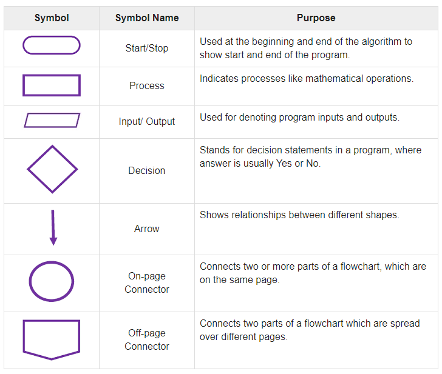
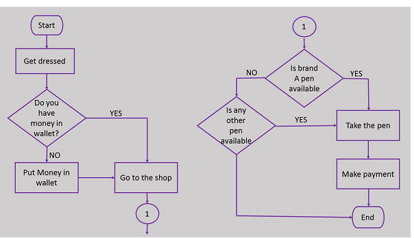
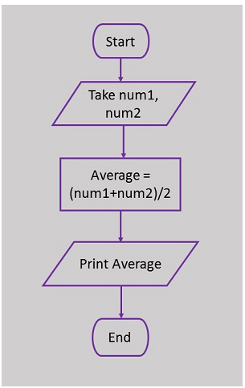
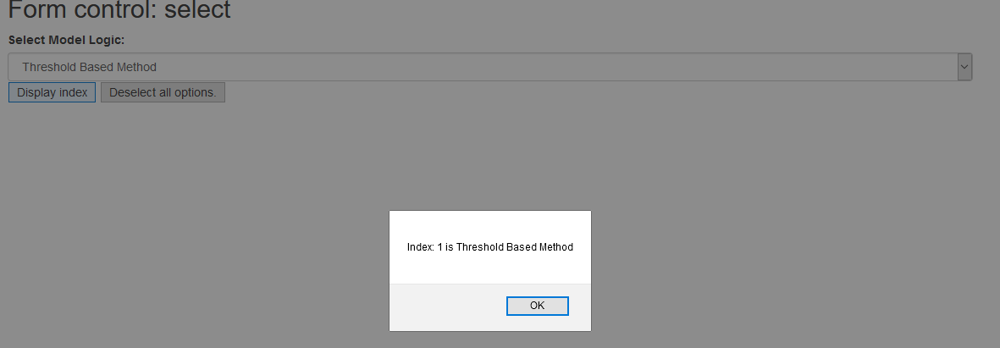

## Flowchart

* A flowchart is a type of diagram that represents an algorithm, workflow or process.
* Five basic flowchart elements:
  * Terminal Box - Start / End
  * Input / Output
  * Process / Instruction
  * Decision
  * Connector / Arrow
* A flowchart can represent an algorithm.
* A flowchart is pictorial representation of an algorithm.
* An algorithm can be expressed and analyzed through a flowchart.
* 
* 
* 



## BootStrap Select List
* Example 25
* Select List: as known as drop-down list.
  * &lt;select&gt; tag
* The value "-1" will deselect all options (if any).
* HTML tag &lt;label&gt;: defines a label. Similar to Caption. Usually bind with clickable elements. We will learn more about this tag when we introduce &lt;form&gt;

## Group Activity 6: 5 minutes
* Work on Example 25:
* Complete the “hole” to display current selected option
* Hint:
  * selectObject.selectedIndex => Return the selectedIndex property (starting from 0)
  * selectObject.selectedIndex = number => Set the selectedIndex property
  * selectObject.options => Return the option (contents)

## BootStrap Input Form
* Bootstrap supports the following form controls:
  * input
  * textarea
  * checkbox
  * radio
  * Select (example 25)
* HTML tag &lt;form&gt;  is used to create an HTML form for user input.
* form-group class is the easiest way to add some structure to forms. It provides a flexible class that encourages proper grouping of labels, controls, optional help text, and form validation messaging.
* We will learn how to build a JSON object based on input data when we learn jQuery.
* Example 26

## Group Activity 7: 7 minutes
* Work on Example 26:
* Complete the “hole” to display inputs
* Hint:
  * document.getElementById(‘ID').value to get the content of an &lt;input&gt;
  * document.getElementById(“ID").checked to get which radio button or checkbox is checked.

## How to Insert Rows in a Table
* Example 27
* table.rows.length shows the total length of your table
* You table row and cell are starting from 0

## Homework 4
* Implement “View”, “Model”, and “Control” parts of the “vampire app”
* “View”
  * Visualization results in a pie chart
  * Need to update visualization results if “Model” logic is changed
* “Model” 
  * Threshold based:
    * No shadow +4, otherwise 0
    * Complexion pale +3, otherwise 0
    * No Garlic +3, otherwise 0
    * Total score > 6, yes; <=6 no
  * Random guess: randomly decide if a student is a vampire.
  * (Optional) Learn more about how to build a decision tree to solve this problem if you want: <https://www.youtube.com/watch?v=SXBG3RGr_Rc>
* “Control”
  * a user should be able to choose different data processing methods (“Model” logic) with a list select box. Sample code introduced in Example 25.
  * A user should be able to upload and display a classmate information with a table. Example 26. 
  * The table should be updated if a piece of new classmate information is input. Example 27.
* Existing student data: Example 24 (classmate_data).
* A flowchart about your vampire app, try Microsoft Visio => onthehub free
* Submit using Github, add Rui (ruiwu1990) and TA as collaborator, one github manager from your team. Due <mark>March 16</mark>

||| [Index](../../)||| [Prev](../file5/)||| [Next](../file7/)|||

