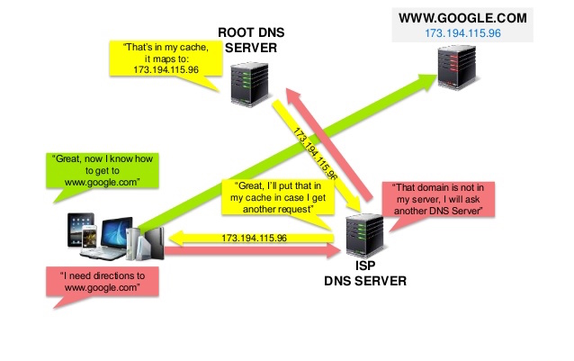

## Version Control Tools
* Popular Version Control Tools
  * Git
  * CVS
  * SVN
  * Mercurial
  * Monotone
* Functions:
  * Rollback to previous version
  * Commit update
  * Compare different versions
  * … 

## How to manage your software version?
* Git
  * Pros
  * Super-fast and efficient performance.
  * Cross-platform
  * Code changes can be very easily and clearly tracked.
  * Easily maintainable and robust.
  * Offers an amazing command line utility known as git bash.
  * Also offers GIT GUI where you can very quickly re-scan, state change, sign off, commit & push the code quickly with just a few clicks.
* Cons
  * Complex and bigger history log become difficult to understand.
  * Does not support keyword expansion and timestamp preservation.

## Github vs Git
* What is Github: GitHub is a code hosting platform for version control and collaboration. It lets you and others work together on projects from anywhere.
* Git is a revision control system, a tool to manage your source code history. GitHub is a hosting service (working blackbox) for Git repositories. So they are not the same thing: Git is the tool, GitHub is the service for projects that use Git.

## How does it work?

* Figure credit: http://massivetechinterview.blogspot.com/2015/12/dns-internal.html

## Demo Github 
* Add collaborators
* Create a repository 
  * Only one repo for this class
* Create a branch
* Commit
* Pull, issue, and merge

## Github Tutorial: Miscellaneous 
* gitignore file (demo)
  * If you create a file in your repository named .gitignore, Git uses it to determine which files and directories to ignore, before you make a commit.
  * A .gitignore file should be committed into your repository, in order to share the ignore rules with any other users that clone the repository.
  * E.g. <https://gist.github.com/octocat/9257657> and <https://github.com/ruiwu1990/db_docker/blob/master/.gitignore>
* README.md: we will learn more when we introduce the server part.
  * .md is short for markdown
  * Here is a good tutorial: <https://daringfireball.net/projects/markdown/syntax>
  * A good template: <https://gist.github.com/PurpleBooth/109311bb0361f32d87a2>
* Conflicts: will happen if there are two different versions for the same line.
  * Try not to work on the same line or Github cannot know how to merge
  * If there is a conflict, you need to find the conflicts and remove or update the conflicting parts.
  * Tips: each team member works on different functions or classes or files or components (e.g., Flask blueprints)

## Final Group Project: Part 1
* Describe your final group project
  * Why: Introduce the motivation of your project.
  * What: ideas and problems to solve
* No less than 200 words.
* Due...

||| [Index](../../)||| [Prev](../file6/)||| [Next](../file8/)|||

