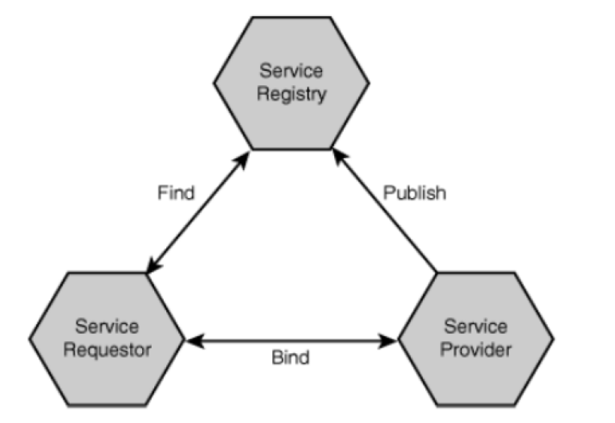

## What is Service-Oriented Architecture (SOA)?
* Service-oriented architecture (SOA) is a style of software design where services are provided to the other components by application components, through a communication protocol over a network (wiki). E.g., Authentication service, “vampire determination” service, data management service.
* We will learn “Docker” to wrap each component.
* Design focus: proper interface for component (familiar from component-oriented design methodologies)
* Goal: build software by composing services over a network

* Service provider actually provides service, publishes details in registry
* Service requestor finds services in registry and calls services
* Service registry acts as matchmaker between requestors (looking for services) and providers (offering services); once a match is made, the registry is no longer involved
* Figure Credit: “Building Web Services with Java”, 2nd Edition

## Flask and SOA

* Project layout:
  * Statistic: static files, usually js files, sometimes a company may pay to place this folder in a closer server near you to reduce loading time.
  * Templates: html files, some html files may need to be dynamically generated with Jinja2
  * .gitignore
  * README.md: need to introduce the project purpose and how to start
    * Markdown Cheatsheet: <https://github.com/adam-p/markdown-here/wiki/Markdown-Cheatsheet>
  * requirements.txt
  * Python files: main and util
* Let’s have a look at this Flask hello world example. Example 34.
  * <https://github.com/ruiwu1990/CSCI_4710_6710.git>
  * Pull right before the class, because there may be some changes…
* Virtual environment is very important. For example, version control of different libraries: jinja 2.10 or jinja 2.9
* Flask is a python framework.
  * Here is the official Python tutorial: <https://docs.python.org/3/tutorial/>
  * We do not have time to introduce Python but it should not be very hard…
  * I will also introduce some basic things about Python through examples.

* All Flask applications must create an application instance
  * app = Flask(__name__)
  * The web server passes all requests it receives from clients to this object for handling, using a protocol called Web Server Gateway Interface (WSGI).
  * Flask keeps a mapping of URLs to Python functions. The association between a URL and the function that handles it is called a route.
  * Default port number is 5000.
* Flask Debug mode:
  * it activates the debugger
  * it activates the automatic reloader
  * it enables the debug mode on the Flask application.
* Dynamically generate a HTML page with Jinja2.
  * {{python_variable}}
  * There are some other fancy ways…
  * We will learn in the future.
  
* Let’s create a very simple service: generate a random number. Example 35.
* Server generate a JSON object and the client display the generated random number
* Python dictionary:
  * Similar to JSON
  * How to access: tmp_dict[“brand”]
  * json.dumps: json encoder
  * We also have JSONDecoder, but not used in this example
* Example: tmp_dict = {
  "brand": “Toyota",
  "model": “4Runner",
  "year": 2018}
* Jquery get request:
  * .get(ULR, function(data){ do something with data})
  * JSON.parse: turn your data into a JavaScript object
 
  
|||[Index](../../)||| [Prev](../)||| [Next](../part3)|||

